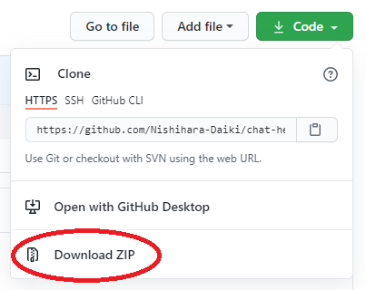

# Chat Helper

## サポート対象
- Chromeブラウザ
- 日本語設定

## インストール方法

Chromeウェブストア未公開のため、ソースコードをダウンロードして追加する必要があります。

1. リポジトリをクローンまたはダウンロード 
	右上の Code ボタンから、Download ZIPをクリックし、ダウンロードされたファイルを解凍します。 
	

1. Chromeの拡張機能ページ [`chrome://extensions/`](chrome://extensions/) を開きます。
1. 右上のデベロッパーモードをオンにします。 
	
1. 「パッケージ化されていない拡張機能を読み込む」から [`src/`](./src) を選択します。 
	

## 使い方

- 拡張機能の設定画面で、使用したい機能をオンにします。（デフォルトはすべてオフ）

## 機能

### スタイルの変更
#### 行間を狭く
チャット画面の行間や余白を調整し、多くのメッセージが表示できるようにします。狭さの強さを３段階で選択できます。

#### ユーザ名太字
チャット画面のユーザ名を太字にします。初期設定の太さでは、アルファベットは太字になりますが、日本語は太字にならないため、太さを上げます。

|  |  |
|--|--|
|変更前||
|変更後||

#### OGP非表示
URL投稿時のサムネイルを隠し、会話が縦に伸びないようにします。

#### 添付ファイルのサムネイル非表示
添付ファイルのサムネイル画像を隠し、会話が縦に伸びないようにします。