# Chat Helper

## サポート対象
- Chromeブラウザ
- 日本語設定

## インストール方法

Chromeウェブストア未公開のため、ソースコードをダウンロードして追加する必要があります。
||手順|スクリーンショット|
|--|--|--|
|1|リポジトリをクローンまたはダウンロードします。 右上の Code ボタンから、Download ZIPをクリックし、 ダウンロードされたファイルを解凍（展開）します。||
|2|Chromeの拡張機能ページ [`chrome://extensions/`](chrome://extensions/)  を開きます。||
|3|右上のデベロッパーモードをオンにします。||
|4|左上の「パッケージ化されていない拡張機能を読み込む」から、 先ほど解凍（展開）したフォルダ [`chat-helper-master/src/`](./src) を選択します。 |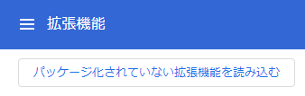|

## 使い方
1. 拡張機能のオプションページを開きます。
	オプションページの開き方は2種類あります。
	- [`chrome://extensions/`](chrome://extensions/)の拡張機能の「詳細」ボタン→画面スクロールして「拡張機能のオプション」をクリックします。
	- 拡張機能アイコンをクリック
1. オプションページで、使用したい機能をオンにします。（デフォルトはすべてオフ）

## 機能

### スタイルの変更
#### 行間を狭く
チャット画面の行間や余白を調整し、多くのメッセージが表示できるようにします。狭さの強さを3段階で選択できます。

#### ユーザ名太字
チャット画面のユーザ名を太字にします。初期設定の太さでは、アルファベットは太字になりますが、日本語は太字にならないため、太さを上げます。
|変更前|変更後|
|--|--|
|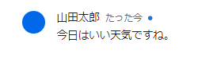||

#### OGP非表示
URL投稿時のサムネイルを隠し、会話が縦に伸びないようにします。
|変更前|画像のみ非表示|全て非表示|
|--|--|--|
|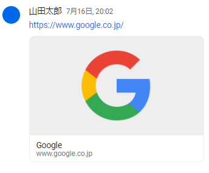|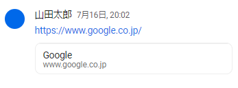|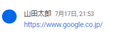|

#### 添付ファイルのサムネイル非表示
添付ファイルのサムネイル画像を隠し、会話が縦に伸びないようにします。
|変更前|変更後|
|--|--|
|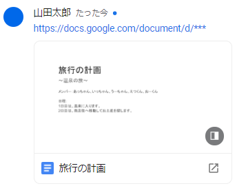|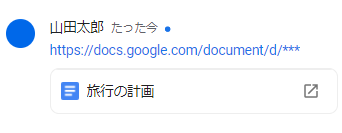|

#### 画像折り畳みの有効化
各画像を小さく折りたたむボタンを表示します。
|変更前|変更後（折りたたむ前）|変更後（折りたたんだ後）|
|--|--|--|
|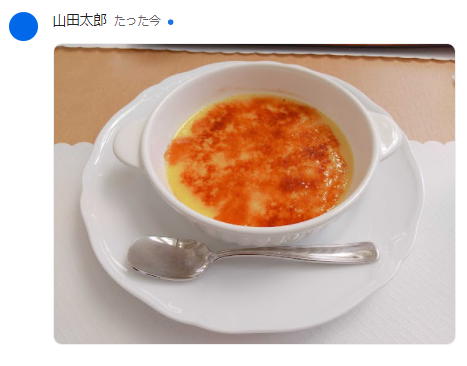|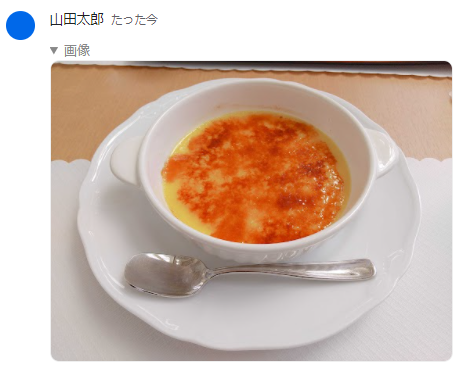||

### 追加情報の表示

#### Markdown
各メッセージをMarkdown形式として認識します。設定により、シンタックスハイライト（ソースコードの色付け）をつけることもできます。
|変更前|変更後（シンタックスハイライトあり）|
|--|--|
|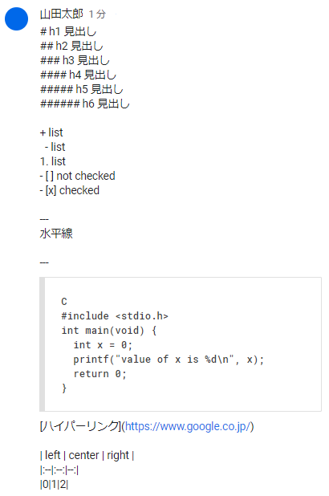||

### メッセージアクション
#### URL取得
各メッセージのURLをクリップボードにコピーするボタンを追加します。
|変更前|変更後|
|--|--|
|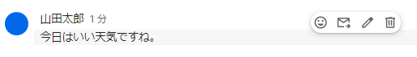|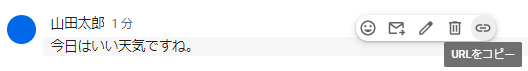|

#### メッセージのピン止め
指定したメッセージのURLを上部に表示します。
|変更前|変更後|
|--|--|
||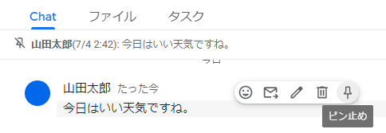|

