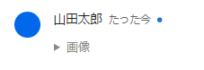

# 機能紹介 - Chat Helper
実装済みの機能を紹介します。

## スタイルの変更
### 行間を狭く
チャット画面の行間や余白を調整し、多くのメッセージが表示できるようにします。狭さの強さを3段階で選択できます。

### ユーザ名太字
チャット画面のユーザ名を太字にします。初期設定の太さでは、アルファベットは太字になりますが、日本語は太字にならないため、太さを上げます。
|変更前|変更後|
|--|--|
|||

### OGP非表示
URL投稿時のサムネイルを隠し、会話が縦に伸びないようにします。
|変更前|画像のみ非表示|全て非表示|
|--|--|--|
||||

### 添付ファイルのサムネイル非表示
添付ファイルのサムネイル画像を隠し、会話が縦に伸びないようにします。
|変更前|変更後|
|--|--|
|||

### 画像折り畳みの有効化
各画像を小さく折りたたむボタンを表示します。
|変更前|変更後（折りたたむ前）|変更後（折りたたんだ後）|
|--|--|--|
||||

## 追加情報の表示

### Markdown
各メッセージをMarkdown形式として認識します。設定により、シンタックスハイライト（ソースコードの色付け）をつけることもできます。
|変更前|変更後（シンタックスハイライトあり）|
|--|--|
|||

### 数式
TeX形式で書かれた数式をレンダリングします。`$`で囲まれた部分はインライン数式、`$$`で囲まれた部分はブロック数式と解釈します。数式中のエラーは赤く表示されます。
|変更前|変更後|
|--|--|
|||

## メッセージアクション
### URL取得
各メッセージのURLをクリップボードにコピーするボタンを追加します。
|変更前|変更後|
|--|--|
|||

### メッセージのピン止め
指定したメッセージのURLを上部に表示します。
|変更前|変更後|
|--|--|
|||

### メッセージのコピー
指定したメッセージのテキストをクリップボードにコピーするボタンを追加します。特に、Markdown、リッチテキスト、数式をコピーしたい場合に役立ちます。
|変更前|変更後|
|--|--|
|||

# 備考
- 山田太郎は説明のために用いた架空のユーザ名です。
