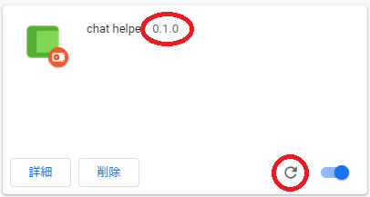

## インストール方法（初めて使うときの手順）

Chromeウェブストア未公開のため、ソースコードをダウンロードして追加する必要があります。 
※gitが使える方は、クローンがお勧めです。更新時が楽です。
||手順|スクリーンショット|
|--|--|--|
|1|リポジトリをクローンまたはダウンロードします。 右上の Code ボタンから、Download ZIPをクリックし、 ダウンロードされたファイルを解凍（展開）します。||
|2|Chromeの拡張機能ページ [`chrome://extensions/`](chrome://extensions/)  を開きます。||
|3|右上のデベロッパーモードをオンにします。||
|4|左上の「パッケージ化されていない拡張機能を読み込む」から、 先ほど解凍（展開）したフォルダ `chat-helper-master/` の中の [`src/`](./src) を選択します。 インストールができたら、デベロッパーモードはオフに戻しても構いません。||

## 更新方法（インストール済みの拡張機能を最新版に更新するときの手順）

gitで管理している方は、pullして手順4.にお進みください。
||手順|スクリーンショット|
|--|--|--|
|1|インストール時と同様にzipファイルを再度ダウンロードします。||
|2|ダウンロードしたzipファイルを解凍（展開）します。||
|3|古いフォルダを新しく解凍（展開）したフォルダで **【上書き】** します。 もしくは、古いフォルダを削除して **同じ** 場所に新しいフォルダを保存します。 ※別の場所に保存して読み込むと、別の拡張機能として 認識されてしまい、2つの拡張機能が競合します。||
|4|Chromeの拡張機能ページ [`chrome://extensions/`](chrome://extensions/)  を開き、更新アイコンをクリックします。 最新のバージョン表記に更新されたら成功です。 ※「削除」ボタンでChromeから削除してインストールを やり直す方法もありますが、その場合、 設定やピン止め等のメモリがリセットされてしまいます。||